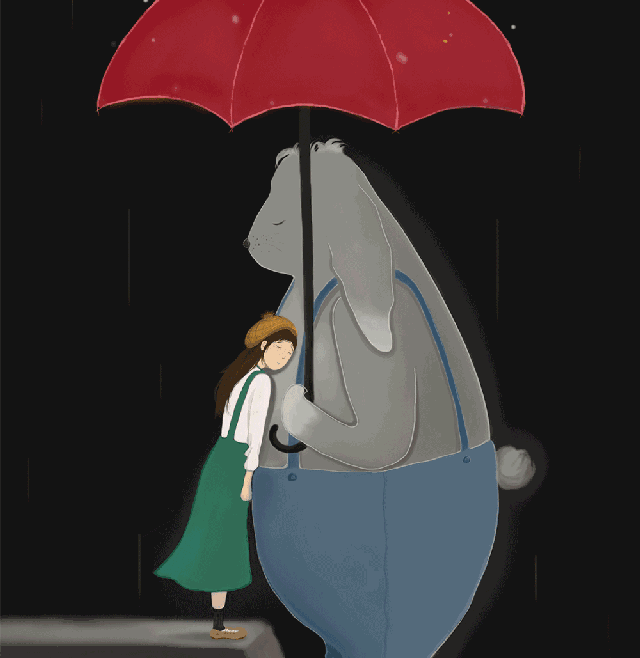

<html>
<head>
 
 <h1 style="color:white;text-align:center"><b>欢迎来到我的第一个网页</b></h1>

</head>
<body background="代码雨2.gif" style="color:green">

 <h2>
  <i>这里是Cylana的第一个网页呀哈哈哈</i>
 </h2>
 

  我一定会继续努力，永不放弃哒 
 

 

  欢迎点击以下链接加入我一起学习
  <a href="https://www.w3school.com.cn/html/html_basic.asp"> W3school中文网</a><a href="https://ke.qq.com/">  腾讯课堂</a>
 

</body>
</html>
